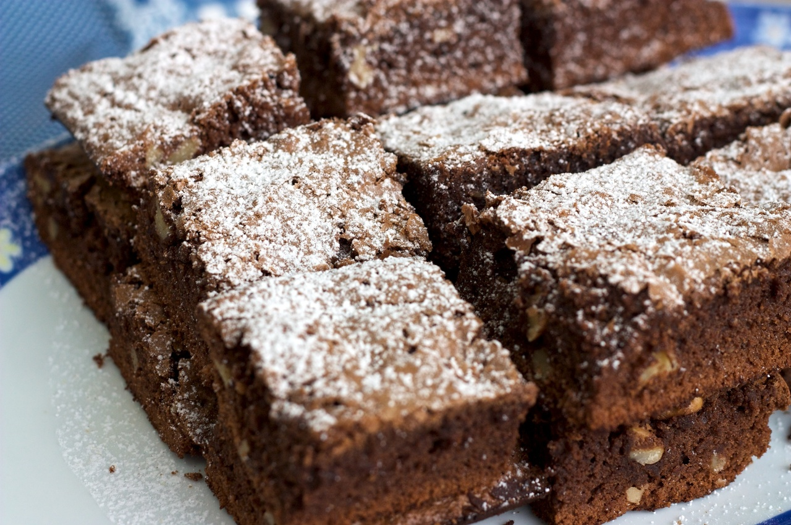

# Butterscotch Brownies

_Photo of some other kind of brownies by [ChefRS](https://www.chefrs.com.br/brownie/) CC-BY-NC_

## Ingredients

- 4 tablespoons of melted butter (50 gms)
- 1 cup brown sugar
- 1 egg beaten
- 1 teaspoon vanilla
- 1 cup flour
- ¼ tsp salt
- 1 tsp baking powder
- 1/2 cup chopped nuts
- 1/2 cup chopped dark chocolate

## Instructions

1. Preheat oven to 160ºC
2. Beat butter and sugar until blended, mix in egg and vanilla (beat well).
3. Sift together flour, baking powder, salt. Fold into the mix, add nuts and chocolate.
4. Put a sheet of baking paper onto a baking tray and spoon the mixture onto the paper.  Smooth it out into a square about 1.5cm thick.  Bake for 20 min or until golden, try not to overbake as the brownies will stiffen as they cool down.
5. Remove from oven and let it cool down.  Cut into small squares and sift icing sugar on top to make them pretty.
6. Eat some delicious brownies.