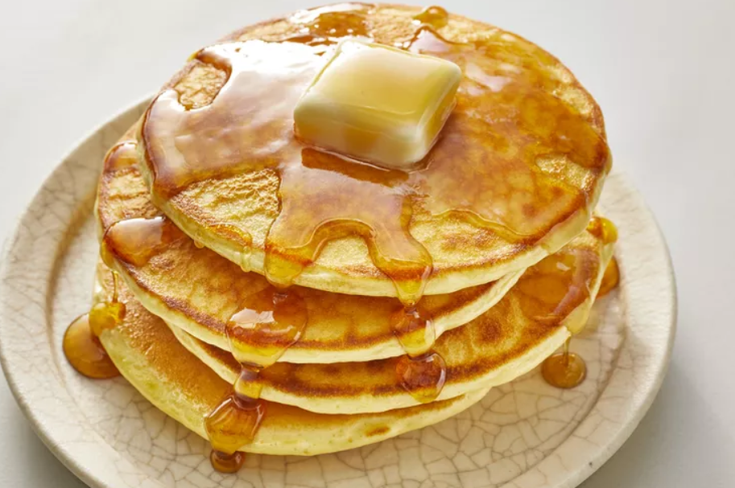

# Pancakes

_some pancake image_

A pancake (or hotcake, griddlecake, or flapjack) is a flat cake, often thin and round, prepared from a starch-based batter that may contain eggs, milk and butter, and then cooked on a hot surface such as a griddle or frying pan. It is a type of batter bread. Archaeological evidence suggests that pancakes were probably eaten in prehistoric societies.

## Ingredients

- 100 g plain flour
- 2 large eggs
- 300 ml milk
- 1 tbsp sunflower or vegetable oil, plus a little extra for frying

## Instructions

1. Put 100g plain flour, 2 large eggs, 300ml milk, 1 tbsp sunflower or vegetable oil and a pinch of salt into a bowl or large jug, then whisk to a smooth batter. This should be similar in consistency to single cream.

2. Set aside for 30 mins to rest if you have time, or start cooking straight away.

3. Set a medium frying pan or crêpe pan over a medium heat and carefully wipe it with some oiled kitchen paper.

4. When hot, cook your pancakes for 1 min on each side until golden, using around half a ladleful of batter per pancake. Keep them warm in a low oven as you make the rest.

5. Serve with lemon wedges and caster sugar, or your favourite filling. Once cold, you can layer the pancakes between baking parchment, then wrap in cling film and freeze for up to two months.